# DeepLabv3Plus-Pytorch

DeepLabV3 and DeepLabV3+ with MobileNetv2 and ResNet backbones for Pytorch.

#### Available Architectures
specify the model architecture with '--model ARCH_NAME' and set the output stride with '--output_stride OUTPUT_STRIDE'.

| DeepLabV3    |  DeepLabV3+        |
| :---: | :---:     |
|deeplabv3_resnet50|deeplabv3plus_resnet50|
|deeplabv3_resnet101|deeplabv3plus_resnet101|
|deeplabv3_mobilenet|deeplabv3plus_mobilenet |

#### Atrous Separable Convolution
Atrous Separable Convolution is supported in this repo. We provide a simple tool ``network.convert_to_separable_conv`` to convert ``nn.Conv2d`` to ``AtrousSeparableConvolution``. **Please run main.py with '--separable_conv' if it is required**. See 'main.py' and 'network/_deeplab.py' for more details. 

## Datsets
* [PASCAL VOC](http://host.robots.ox.ac.uk/pascal/VOC/)

## Results

#### Results on PASCAL VOC2012 Aug (In Progress)

|  Model          | Batch Size  | FLOPs  | train/val OS   |  mIoU        | Checkpoint  |
| :--------        | :-------------: | :----:   | :-----------: | :--------: | :--------: | 
| DeepLabV3Plus-MobileNetV2   | 16     |  3.103G      |  16/16   |  0.711     |    [Dropbox](https://www.dropbox.com/s/dgq6viw1d7ghbox/best_deeplabv3plus_mobilenet_voc_os8.pth?dl=0)   |
| DeepLabV3-MobileNetV2       | -      |  2.187G      |  -       |  -         |    -   |
| DeepLabV3Plus-ResNet101     | -      |  25.91G      |  16/16   |  -         |    -   |
| DeepLabV3-ResNet101         | -      |  24.97G      |    -     |  -         |    -   |


#### Segmentation Results (DeepLabv3Plus-MobileNet)

<div>
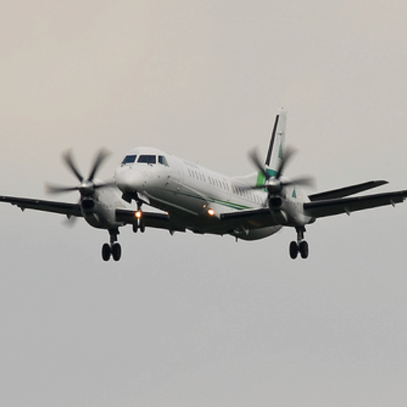
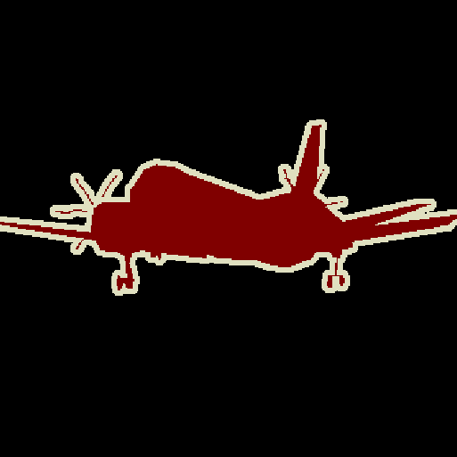

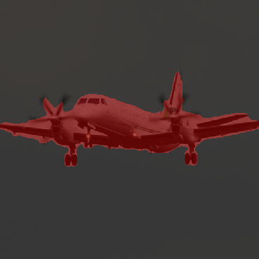
</div>

<div>
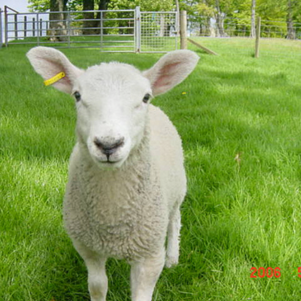
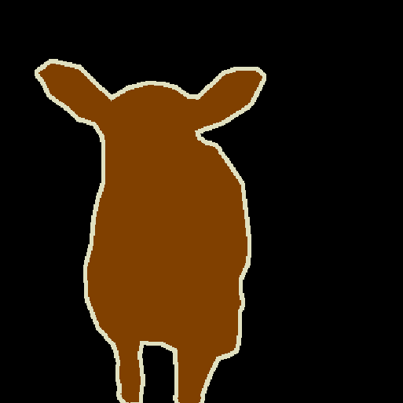
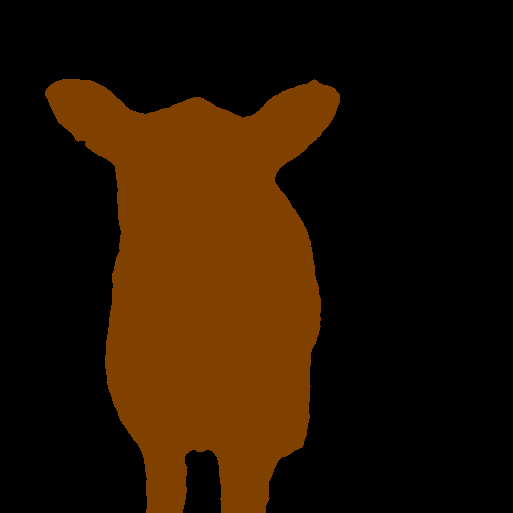
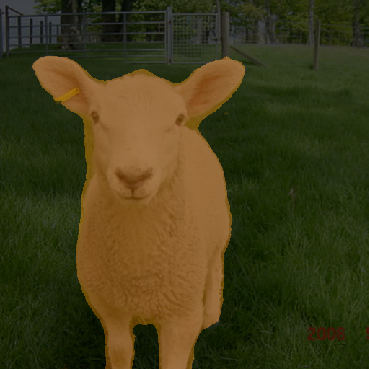
</div>

<div>
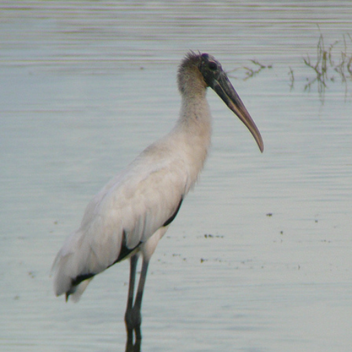
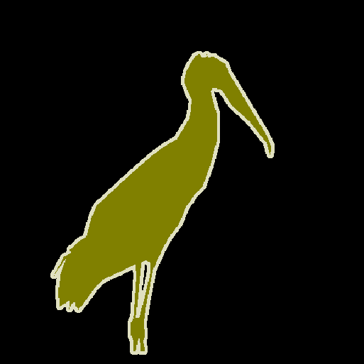
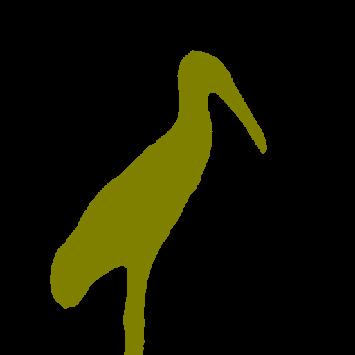
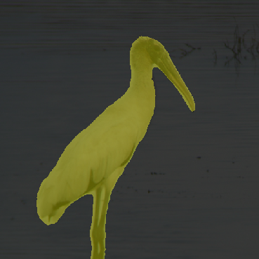
</div>


#### Vsualization of training


## Quick Start

### 1. Requirements

```bash
pip install -r requirements.txt
```

### 2. Prepare Datasets

#### pascal voc
You can run train.py with "--download" option to download and extract pascal voc dataset. The defaut path is './datasets/data':

```
/datasets
    /data
        /VOCdevkit 
            /VOC2012 
                /SegmentationClass
                /JPEGImages
                ...
            ...
        /VOCtrainval_11-May-2012.tar
        ...
```

#### trainaug (Recommended)

See chapter 4 of [2]

        The original dataset contains 1464 (train), 1449 (val), and 1456 (test) pixel-level annotated images. We augment the dataset by the extra annotations provided by [76], resulting in 10582 (trainaug) training images. The performance is measured in terms of pixel intersection-over-union averaged across the 21 classes (mIOU).

*./datasets/data/train_aug.txt* includes names of 10582 trainaug images (val images are excluded). You need to download additional labels from [Dropbox](https://www.dropbox.com/s/oeu149j8qtbs1x0/SegmentationClassAug.zip?dl=0) or [Tencent Weiyun](https://share.weiyun.com/5NmJ6Rk). Those labels come from [DrSleep's repo](https://github.com/DrSleep/tensorflow-deeplab-resnet).

**Please extract trainaug files (SegmentationClassAug) to the VOC2012 directory.**

```
/datasets
    /data
        /VOCdevkit  
            /VOC2012
                /SegmentationClass
                /SegmentationClassAug
                /JPEGImages
                ...
            ...
        /VOCtrainval_11-May-2012.tar
        ...
```

### 3. Train

#### Visualize training (Optional)

Start visdom sever for visualization. Please remove '--enable_vis' if visualization is not needed. 

```bash
# Run visdom server on port 28333
visdom -port 28333
```

#### Train with OS=16

Run main.py with *"--year 2012_aug"* to train your model on PASCAL VOC2012 Aug.

```bash
python main.py --model deeplabv3plus_mobilenet --enable_vis --vis_port 28333 --gpu_id 0 --year 2012_aug --crop_val --lr 0.01 --crop_size 513 --batch_size 16 --output_stride 16
```

#### Continue training

Run main.py with '--continue_training' to restore the state_dict of optimizer and scheduler from YOUR_CKPT.

```bash
python main.py ... --ckpt YOUR_CKPT --continue_training
```

### 4. Test

Results will be saved at ./results.

```bash
python main.py --model deeplabv3plus_mobilenet --enable_vis --vis_port 28333 --gpu_id 0 --year 2012_aug --crop_val --lr 0.01 --crop_size 513 --batch_size 16 --output_stride 16 --ckpt checkpoints/best_deeplabv3plus_mobilenet_voc_os16.pth --test_only
```

## Reference

[1] [Rethinking Atrous Convolution for Semantic Image Segmentation](https://arxiv.org/abs/1706.05587)

[2] [Encoder-Decoder with Atrous Separable Convolution for Semantic Image Segmentation](https://arxiv.org/abs/1802.02611)
