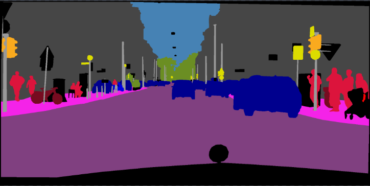
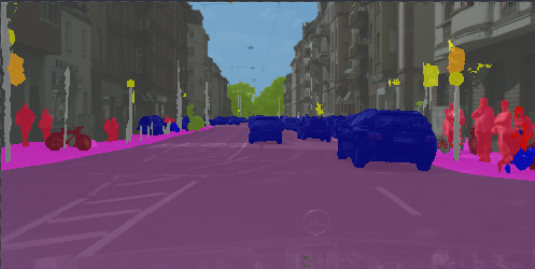
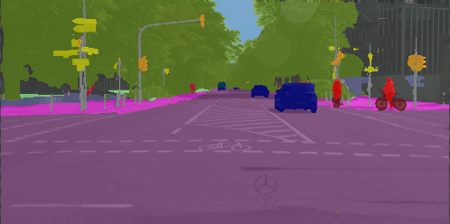

# DeepLabv3Plus-Pytorch

DeepLabV3 and DeepLabV3+ with MobileNetv2 and ResNet backbones for Pytorch.

#### Available Architectures
Specify the model architecture with '--model ARCH_NAME' and set the output stride with '--output_stride OUTPUT_STRIDE'.

| DeepLabV3    |  DeepLabV3+        |
| :---: | :---:     |
|deeplabv3_resnet50|deeplabv3plus_resnet50|
|deeplabv3_resnet101|deeplabv3plus_resnet101|
|deeplabv3_mobilenet|deeplabv3plus_mobilenet |

All available pretrained models: [Dropbox](https://www.dropbox.com/sh/w3z9z8lqpi8b2w7/AAB0vkl4F5vy6HdIhmRCTKHSa?dl=0)


#### Atrous Separable Convolution
Atrous Separable Convolution is supported in this repo. We provide a simple tool ``network.convert_to_separable_conv`` to convert ``nn.Conv2d`` to ``AtrousSeparableConvolution``. **Please run main.py with '--separable_conv' if it is required**. See 'main.py' and 'network/_deeplab.py' for more details. 

## Datasets
* [Pascal VOC](http://host.robots.ox.ac.uk/pascal/VOC/)
* [Cityscapes](https://www.cityscapes-dataset.com/)

## Results

#### Performances on Pascal VOC2012 Aug (20 classes, 513 x 513, 513 random crop)

|  Model          | Batch Size  | FLOPs  | train/val OS   |  mIoU        | Checkpoint  |
| :--------        | :-------------: | :----:   | :-----------: | :--------: | :--------: | 
| DeepLabV3Plus-MobileNet   | 16      |  17.0G      |  16/16   |  0.711    |    [Download](https://www.dropbox.com/s/0idrhwz6opaj7q4/best_deeplabv3plus_mobilenet_voc_os16.pth?dl=0)   |
| DeepLabV3-MobileNet       | 16      |  6.0G      |   16/16  |  0.701     |    [Download](https://www.dropbox.com/s/uhksxwfcim3nkpo/best_deeplabv3_mobilenet_voc_os16.pth?dl=0)       |
| DeepLabV3Plus-ResNet101     | 16      |  83.4G     |  16/16   |  0.783     |    [Download](https://www.dropbox.com/s/bm3hxe7wmakaqc5/best_deeplabv3plus_resnet101_voc_os16.pth?dl=0)   |
| DeepLabV3-ResNet101         | 16      |  72.1G     |  16/16   |  0.773     |    [Download](https://www.dropbox.com/s/vtenndnsrnh4068/best_deeplabv3_resnet101_voc_os16.pth?dl=0)       |

#### Performances on Cityscapes (19 classes, 1024 x 2048, 768 random crop)

|  Model          | Batch Size  | FLOPs  | train/val OS   |  mIoU        | Checkpoint  |
| :--------        | :-------------: | :----:   | :-----------: | :--------: | :--------: | 
| DeepLabV3Plus-MobileNet   | 16      |  135G      |  16/16   |  0.721  |    [Download](https://www.dropbox.com/s/753ojyvsh3vdjol/best_deeplabv3plus_mobilenet_cityscapes_os16.pth?dl=0)       |
| DeepLabV3-MobileNet       | -      |  47.2G     |  16/16   |  -      |    -       |
| DeepLabV3Plus-ResNet101     | -      |  634G    |  16/16   |  -      |    -       |
| DeepLabV3-ResNet101         | -      |  545G     |  16/16   |  -      |    -       |

#### Segmentation Results on Pascal VOC2012 (DeepLabv3Plus-MobileNet)

<div>


</div>

<div>


</div>

<div>


</div>

#### Segmentation Results on Cityscapes (DeepLabv3Plus-MobileNet)

<div>


</div>

<div>


</div>


#### Vsualization of training


## Quick Start

### 1. Requirements

```bash
pip install -r requirements.txt
```

### 2. Prepare Datasets

#### pascal voc
You can run train.py with "--download" option to download and extract pascal voc dataset. The defaut path is './datasets/data':

```
/datasets
    /data
        /VOCdevkit 
            /VOC2012 
                /SegmentationClass
                /JPEGImages
                ...
            ...
        /VOCtrainval_11-May-2012.tar
        ...
```

#### trainaug (Recommended)

See chapter 4 of [2]

        The original dataset contains 1464 (train), 1449 (val), and 1456 (test) pixel-level annotated images. We augment the dataset by the extra annotations provided by [76], resulting in 10582 (trainaug) training images. The performance is measured in terms of pixel intersection-over-union averaged across the 21 classes (mIOU).

*./datasets/data/train_aug.txt* includes names of 10582 trainaug images (val images are excluded). You need to download additional labels from [Dropbox](https://www.dropbox.com/s/oeu149j8qtbs1x0/SegmentationClassAug.zip?dl=0) or [Tencent Weiyun](https://share.weiyun.com/5NmJ6Rk). Those labels come from [DrSleep's repo](https://github.com/DrSleep/tensorflow-deeplab-resnet).

**Please extract trainaug files (SegmentationClassAug) to the VOC2012 directory.**

```
/datasets
    /data
        /VOCdevkit  
            /VOC2012
                /SegmentationClass
                /SegmentationClassAug
                /JPEGImages
                ...
            ...
        /VOCtrainval_11-May-2012.tar
        ...
```

### 3. Train on Pascal VOC2012 Aug

#### Visualize training (Optional)

Start visdom sever for visualization. Please remove '--enable_vis' if visualization is not needed. 

```bash
# Run visdom server on port 28333
visdom -port 28333
```

#### Train with OS=16

Run main.py with *"--year 2012_aug"* to train your model on Pascal VOC2012 Aug.

```bash
python main.py --model deeplabv3plus_mobilenet --enable_vis --vis_port 28333 --gpu_id 0 --year 2012_aug --crop_val --lr 0.01 --crop_size 513 --batch_size 16 --output_stride 16
```

#### Continue training

Run main.py with '--continue_training' to restore the state_dict of optimizer and scheduler from YOUR_CKPT.

```bash
python main.py ... --ckpt YOUR_CKPT --continue_training
```

### 4. Test

Results will be saved at ./results.

```bash
python main.py --model deeplabv3plus_mobilenet --enable_vis --vis_port 28333 --gpu_id 0 --year 2012_aug --crop_val --lr 0.01 --crop_size 513 --batch_size 16 --output_stride 16 --ckpt checkpoints/best_deeplabv3plus_mobilenet_voc_os16.pth --test_only --save_val_results
```

## Cityscapes

### 1. Download cityscapes and extract it to 'datasets/data/cityscapes'

```
/datasets
    /data
        /cityscapes
            /gtFine
            /leftImg8bit
```

### 2. Train your model on Cityscapes

```bash
python main.py --model deeplabv3plus_mobilenet --dataset cityscapes --enable_vis --vis_port 28333 --gpu_id 0  --lr 0.1  --crop_size 768 --batch_size 16 --output_stride 16 --data_root ./datasets/data/cityscapes 
```

## Reference

[1] [Rethinking Atrous Convolution for Semantic Image Segmentation](https://arxiv.org/abs/1706.05587)

[2] [Encoder-Decoder with Atrous Separable Convolution for Semantic Image Segmentation](https://arxiv.org/abs/1802.02611)
