# DeepLabv3-plus.pytorch

Pytorch implementation of [DeepLabv3+](https://arxiv.org/abs/1802.02611). Pretrained Resnet101 from torchvision are used as backbone.

## Datsets
* [PASCAL VOC](http://host.robots.ox.ac.uk/pascal/VOC/)

## Results

#### Crop Evaluation

The model are trained with **small batch size (8) and fixed batchnorm** due to GPU memory limitations. It required 8GB to train deeplab on one Quadro P5000. Please try to use larger batch size and finetune batchnorm if you want better performance.

| Backbone          | OS (Train/Val)     | Overall Acc   | Mean IoU        |  Fix BN   | Separable Conv  |  
| :--------:        | :-------------:    | :-----------: | :--------:      |  :-----:  | :--------:      |
| ResNet101         | 16/16              |  94.03%       |  76.88%         |    Yes    |     No          |
| ResNet101         | 16/16              |  94.01%       |  76.74%         |    Yes    |     Yes         |
| ResNet101 (Paper) | 16/16              |    -          |  78.85%         |    No     |     Yes         |


#### Vsualization of training


#### Segmentation Results

<div>
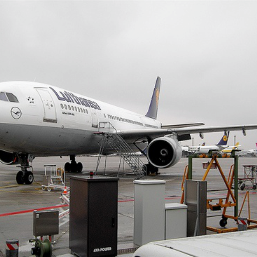
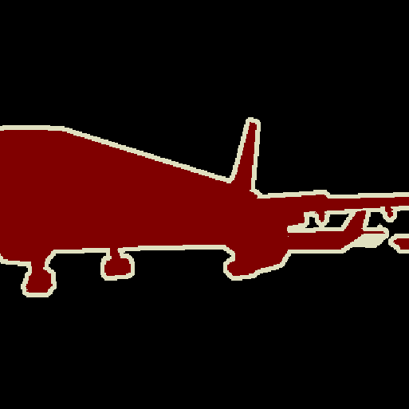

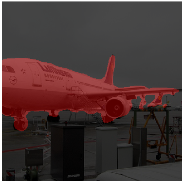
</div>

<div>
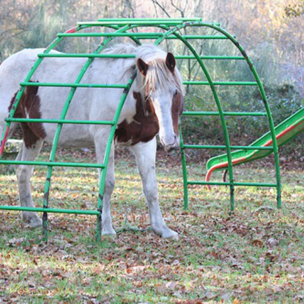
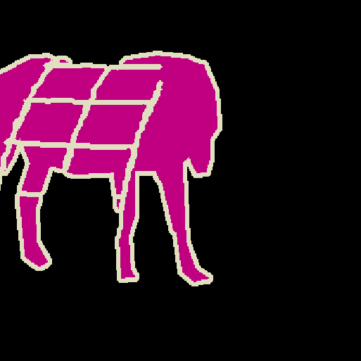
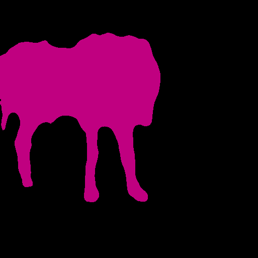
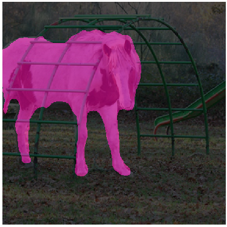
</div>

<div>

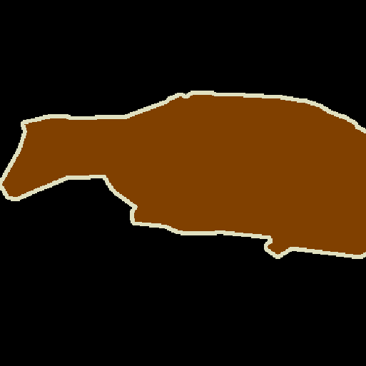
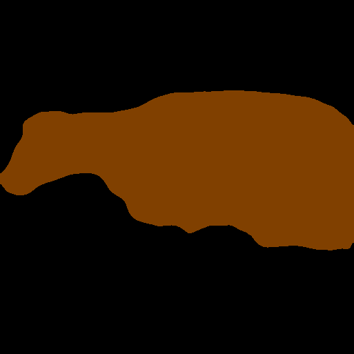
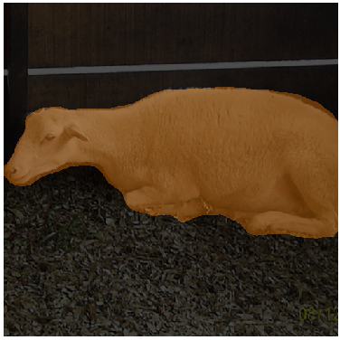
</div>

<div>
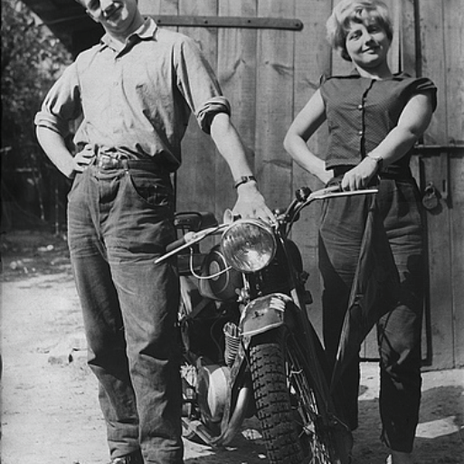


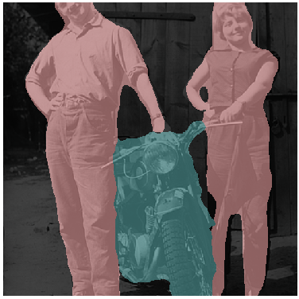
</div>


## Quick Start

### 1. Requirements
* Pytorch
* Torchvision
* Numpy
* Pillow
* scikit-learn
* tqdm
* matplotlib

### 2. Prepare Datasets

#### pascal voc
You can run train.py with "--download" option to download and extract pascal voc dataset. The defaut path is './datasets/data' which should be like this: 

```
/data
    /VOCdevkit 
        /VOC2012 
            /SegmentationClass
            /JPEGImages
            ...
        ...
    /VOCtrainval_11-May-2012.tar
    ...
```

#### trainaug

See chapter 4 of [2]

         The original dataset contains 1464 (train), 1449 (val), and 1456 (test) pixel-level annotated images. We augment the dataset by the extra annotations provided by [76], resulting in 10582 (trainaug) training images. The performance is measured in terms of pixel intersection-over-union averaged across the 21 classes (mIOU).

*./datasets/data/train_aug.txt* includes names of 10582 trainaug images (val images are excluded). You need to download extra annatations from [Dropbox](https://www.dropbox.com/s/oeu149j8qtbs1x0/SegmentationClassAug.zip?dl=0) or [Tencent Weiyun](https://share.weiyun.com/5NmJ6Rk). Those annotations come from [DrSleep's repo](https://github.com/DrSleep/tensorflow-deeplab-resnet).

**Please extract trainaug files (SegmentationClassAug) to the VOC2012 directory.**

```
/DATA_DIR
    /VOCdevkit  
        /VOC2012
            /SegmentationClass
            /SegmentationClassAug
            /JPEGImages
            ...
        ...
    /VOCtrainval_11-May-2012.tar
    ...
```

### 3. Train

#### Visualize training (Optional)

Start visdom sever for visualization.
```bash
# Run visdom server on port 8097
visdom -port 8097
```

#### Train on PASCAL VOC2012 Aug (Recommended)

Run train.py with *"--year 2012_aug"*

```bash
python train.py --backbone resnet101 --dataset voc --year 2012_aug --data_root ./datasets/data  --lr 4e-4 --epochs 30  --batch_size 8 --use_separable_conv --fix_bn --crop_val --enable_vis --vis_env deeplab --vis_port 8097 
```

#### Train on Standard PASCAL VOC2012

Run train.py with *"--year 2012"*

```bash
python train.py --backbone resnet101 --dataset voc --year 2012 --data_root ./datasets/data  --lr 4e-4 --epochs 30  --batch_size 8 --use_separable_conv --fix_bn --crop_val --enable_vis --vis_env deeplab --vis_port 8097 
```

### 4. Test

Results and images will be saved at save_path.

```bash
python test.py --backbone resnet101 --dataset voc --year 2012 --data_root ./datasets/data --batch_size 8 --use_separable_conv --crop_val --ckpt checkpoints/best_resnet101_voc.pkl --save_path ./results
```

## More Details

* If GPU memory is limited, try to reduce crop size or batch size. Note that batchnorm needs large bacth size. As an alternative, you can try [group normalization (GN)](https://arxiv.org/abs/1803.08494).

* Multi-Grid are **not introduced** in this repo according to the paper. see 4.3 of [2].

        Note that we do not employ the multi-grid method [77,78,23], which we found does not improve the performance.

* About Data augmentation. see 4.1 of [1]
  
        Data augmentation: We apply data augmentation by randomly scaling the input images (from 0.5 to 2.0) and randomly left-right flipping during training.

## Reference

[1] [Rethinking Atrous Convolution for Semantic Image Segmentation]([https://arxiv.org/pdf/1706.05587.pdf](https://arxiv.org/abs/1706.05587))

[2] [Encoder-Decoder with Atrous Separable Convolution for Semantic Image Segmentation](https://arxiv.org/abs/1802.02611)